# Peachy Studio — 15 propuestas de plantilla de historia

Formato **9:16 · 1080 × 1920 px**, válido igual para **historias de Instagram y de
Facebook**. Pensadas para vivir años: se editan cambiando texto y foto, nunca
rehaciendo el diseño.

Maquetas renderizadas: [`plantillas/png/`](plantillas/png/) · fuentes editables: [`plantillas/html/`](plantillas/html/)

---

## 1. Antes de las plantillas: el criterio

Peachy Studio no necesita quince diseños distintos. Necesita **cuatro chasis**
que aguanten quince usos. Un chasis es un esqueleto: mismas zonas seguras, mismo
pie de marca, mismos tamaños de texto; lo único que cambia es el contenido.

| Chasis | Qué resuelve | Usos que soporta |
|--------|--------------|------------------|
| **A · FOTO** | La foto o el video manda, el texto acompaña | 1, 2, 3, 15 |
| **B · AGENDA** | Disponibilidad y urgencia, sin foto | 10, 11 |
| **C · INTERACCIÓN** | Deja hueco limpio para el sticker nativo de IG/FB | 4, 5, 8 |
| **D · AVISO** | Mensaje de texto: lista, precio, política o tip | 6, 7, 9, 12, 13, 14 |

Por eso al final de este documento hay una **recomendación de cuáles cuatro
construir primero**: son las cuatro que cubren los quince usos.

## 2. Especificación técnica (aplica a las cuatro)

| Parámetro | Valor |
|-----------|-------|
| Lienzo | 1080 × 1920 px (9:16) |
| Zona segura superior | 300 px — ahí van el avatar y el nombre de la cuenta |
| Zona segura inferior | 290 px — ahí va la barra de respuesta y el link |
| Área útil real | 1080 × 1330 px |
| Márgenes laterales | 84 px |
| Cuerpo mínimo de texto | 40 px (se lee en un celular a un brazo de distancia) |
| Pie de marca | Logotipo + WhatsApp, siempre en el mismo lugar |
| Exportación | PNG para pieza fija · MP4 para pieza con video |

Regla de oro: **nada importante arriba de 300 px ni abajo de 1630 px.** Si el
texto entra ahí, Instagram lo tapa con su propia interfaz.

## 3. Las 15 propuestas

### Resumen

| # | Plantilla | Objetivo | Etapa | Chasis | Frecuencia |
|---|-----------|----------|-------|--------|------------|
| 1 | Diseño del día | Demostrar el trabajo y provocar el deseo | Atracción | A | 3–5 / semana |
| 2 | Antes y después | Vencer la objeción “mis uñas están muy mal” | Consideración | A | 1 / semana |
| 3 | Detrás de cámaras | Mostrar higiene y técnica; humanizar | Consideración | A | 2 / semana |
| 4 | Esto o esto | Ganar interacción y saber qué gusta | Atracción | C | 1–2 / semana |
| 5 | Cotiza tu diseño | Abrir conversaciones de WhatsApp | Conversión | C | 1 / semana |
| 6 | Tip de cuidado | Autoridad: “uñas bonitas, uña sana” | Consideración | D | 1 / semana |
| 7 | Mito y verdad | Desactivar el miedo al gel / al daño | Consideración | D | 1 cada 15 días |
| 8 | Testimonio | Prueba social de terceros | Consideración | C | 1 / semana |
| 9 | Menú de precios | Filtrar y transparentar, menos “¿cuánto?” | Conversión | D | 1 cada 15 días |
| 10 | Agenda de la semana | Llenar la semana con escasez real | Conversión | B | 1 / semana (lunes) |
| 11 | Último lugar de hoy | Monetizar huecos y cancelaciones | Conversión | B | Cuando haya hueco |
| 12 | Promo del mes | Activar demanda en semanas bajas | Conversión | D | 1 / mes + recordatorios |
| 13 | Cómo agendar | Bajar fricción y proteger la agenda | Conversión | D | 1 cada 15 días |
| 14 | Recordatorio de retoque | Retención y recompra | Retención | D | 1 / semana |
| 15 | Nueva técnica | Novedad y ticket más alto | Atracción | A | Cuando haya algo nuevo |

---

### 01 · Diseño del día
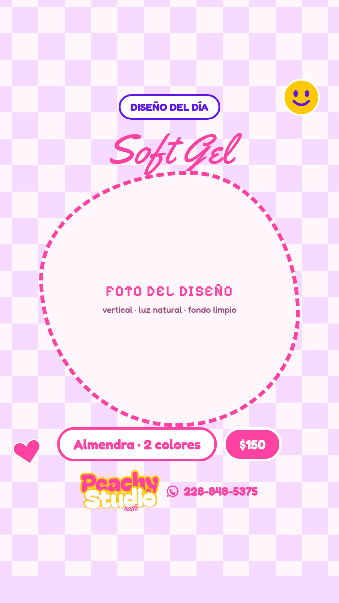

**Objetivo:** que el trabajo terminado sea la publicidad. Es el motor de contenido
del studio: la historia que sostiene la presencia diaria sin pensar qué publicar.

- **Qué hace por el negocio:** construye portafolio público y genera el “yo quiero ese”, que es el mensaje de WhatsApp más fácil de cerrar.
- **Qué se ve:** etiqueta superior, nombre del diseño en script, foto grande en marco orgánico, técnica y precio en píldoras, pie de marca.
- **Campos editables:** etiqueta · nombre del diseño · foto · forma y colores · precio.
- **CTA:** “Cotiza el tuyo” o sticker de link a WhatsApp.
- **Cómo medir:** respuestas a la historia y mensajes que citan la foto.

### 02 · Antes y después
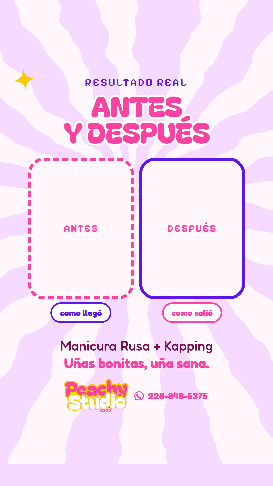

**Objetivo:** atacar la objeción número uno de una clienta nueva — *“me da pena,
tengo las uñas muy maltratadas”*.

- **Qué hace por el negocio:** convierte a quien lleva meses sin ir. Es la pieza que más confianza genera con menos palabras.
- **Qué se ve:** título fijo, dos huecos de foto etiquetados ANTES y DESPUÉS, servicio aplicado y el claim de marca.
- **Campos editables:** las dos fotos · servicio aplicado · claim.
- **CTA:** “Agenda tu cita”.
- **Cómo medir:** mensajes de casos “difíciles” (uña mordida, retiro de otro salón).

### 03 · Detrás de cámaras
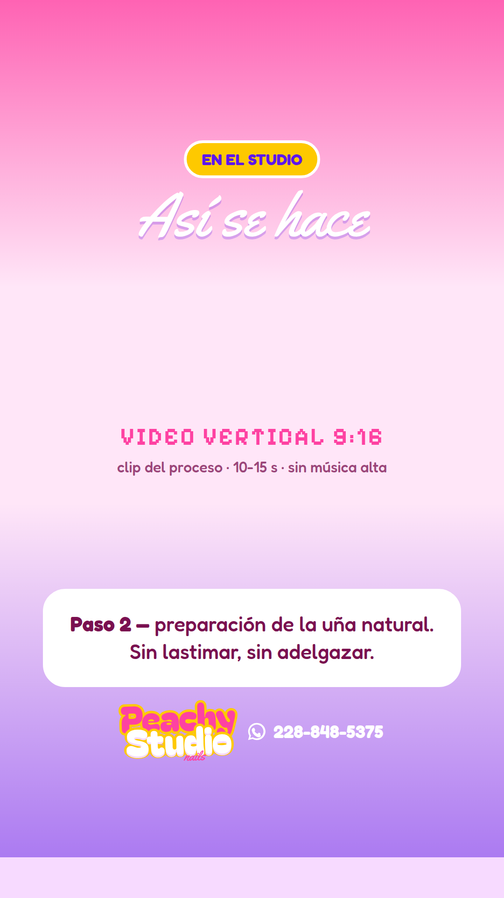

**Objetivo:** vender el proceso, no solo el resultado. Aquí se demuestra higiene,
herramienta y técnica: exactamente lo que diferencia a un studio de un salón cualquiera.

- **Qué hace por el negocio:** justifica el precio y baja la sensibilidad al costo. También es el formato que mejor rinde en alcance.
- **Qué se ve:** video vertical a sangre, degradado de marca arriba y abajo, etiqueta, título en script y una tarjeta explicando el paso.
- **Campos editables:** video · número y nombre del paso · explicación de una línea.
- **CTA:** ninguno duro; máximo “pregúntame lo que quieras”.
- **Cómo medir:** retención del video y respuestas con preguntas técnicas.

### 04 · Esto o esto
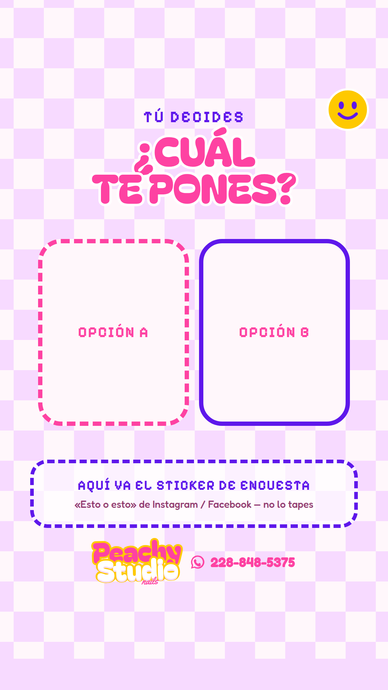

**Objetivo:** interacción barata y útil. Cada voto le dice al algoritmo que la
cuenta importa, y a Peachy qué diseño conviene ofrecer la semana siguiente.

- **Qué hace por el negocio:** sube el alcance de todas las historias del día y funciona como investigación de mercado gratis.
- **Qué se ve:** pregunta grande, dos huecos de foto A y B, y un **espacio reservado y marcado** para el sticker nativo de encuesta.
- **Campos editables:** pregunta · dos fotos.
- **CTA:** el propio sticker de encuesta.
- **Cómo medir:** número de votos y reparto entre opciones.

### 05 · Cotiza tu diseño
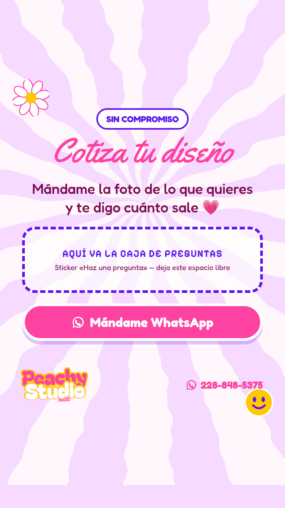

**Objetivo:** abrir conversación. Es la plantilla que convierte seguidoras
pasivas en mensajes de WhatsApp, sin sonar a venta.

- **Qué hace por el negocio:** genera leads calificados — quien manda una foto ya decidió que quiere uñas, solo falta el precio y la fecha.
- **Qué se ve:** titular en script, invitación corta, hueco marcado para la caja de preguntas y botón de WhatsApp.
- **Campos editables:** titular · invitación · CTA.
- **CTA:** “Mándame WhatsApp”.
- **Cómo medir:** respuestas a la caja de preguntas y mensajes nuevos ese día.

### 06 · Tip de cuidado
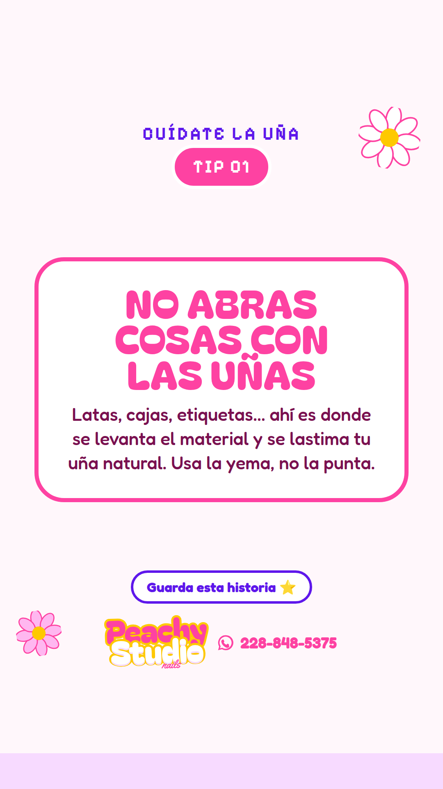

**Objetivo:** ser la que enseña. Sostiene la mitad del tagline que casi nadie usa:
*“Cuídate la uña.”*

- **Qué hace por el negocio:** construye autoridad y diferencia a Peachy de quien solo “pone uñas”. Además son las historias que más se guardan y se comparten.
- **Qué se ve:** etiqueta CUÍDATE LA UÑA, número de tip, titular corto en tarjeta blanca y dos líneas de explicación.
- **Campos editables:** número de tip · titular · explicación.
- **CTA:** “Guarda esta historia”.
- **Cómo medir:** guardados y compartidos.
- **Bonus:** numerados (TIP 01, 02, 03…) se vuelven una serie coleccionable y un destacado del perfil.

### 07 · Mito y verdad
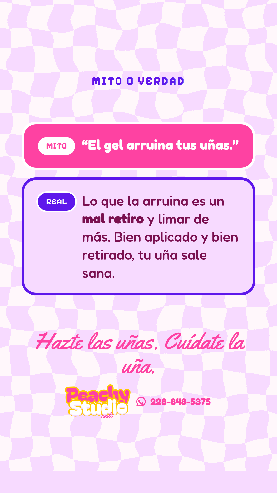

**Objetivo:** desmontar la creencia que más citas cuesta: *“el gel arruina las uñas”*.

- **Qué hace por el negocio:** convierte a la clienta que se hizo uñas una vez, le fue mal y no volvió. Es contenido de rescate.
- **Qué se ve:** bloque MITO en rosa, bloque REAL en lila, y el claim de marca cerrando.
- **Campos editables:** mito · realidad · claim.
- **CTA:** implícito; funciona bien encadenada con la 05.
- **Cómo medir:** respuestas y preguntas de seguimiento.

### 08 · Testimonio
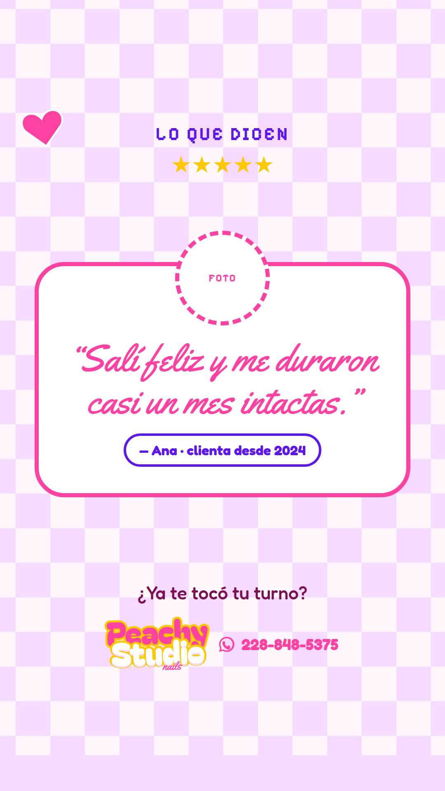

**Objetivo:** que hable alguien más. Lo que dice una clienta pesa más que
cualquier cosa que diga la marca.

- **Qué hace por el negocio:** prueba social — el último empujón antes de agendar.
- **Qué se ve:** estrellas, foto o captura de la clienta en marco circular, testimonio en script y firma.
- **Campos editables:** foto o captura · testimonio · nombre y antigüedad.
- **CTA:** “¿Ya te tocó tu turno?”.
- **Cómo medir:** mensajes que mencionan a la clienta o el testimonio.
- **Nota:** pedir siempre permiso antes de publicar nombre o captura.

### 09 · Menú de precios
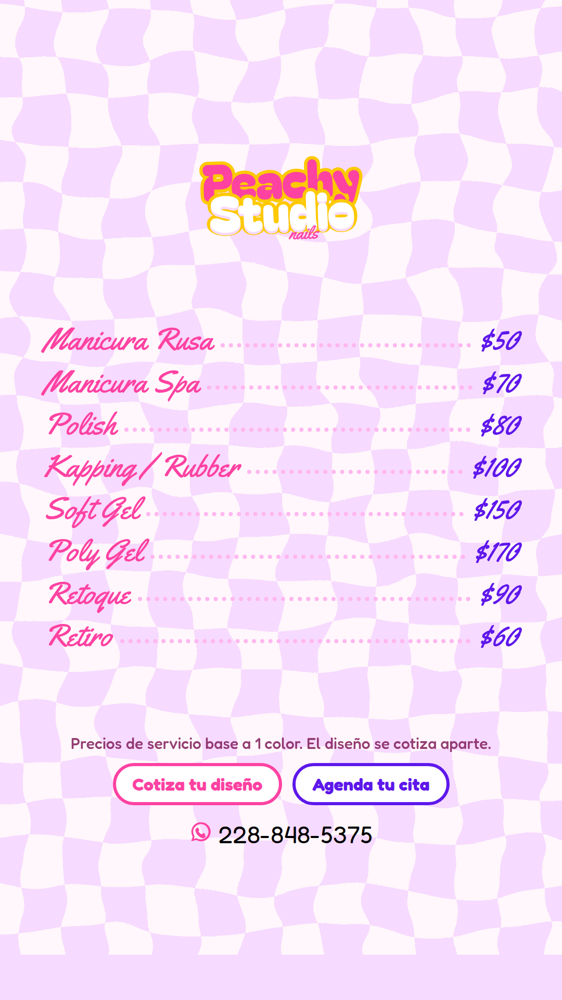

**Objetivo:** contestar de una vez la pregunta que más tiempo consume — *“¿cuánto cuesta?”*.

- **Qué hace por el negocio:** filtra. Quien escribe después de ver precios ya viene calificada, y ahorra decenas de conversaciones muertas al mes.
- **Qué se ve:** logotipo, lista de servicios con guías punteadas y precios, nota al pie y contacto.
- **Campos editables:** servicios · precios · nota al pie.
- **CTA:** “Cotiza tu diseño · Agenda tu cita”.
- **Cómo medir:** proporción de mensajes que ya no preguntan precio.
- **Mantenimiento:** es la única plantilla con fecha de caducidad real. Revisar cada tres meses.

### 10 · Agenda de la semana
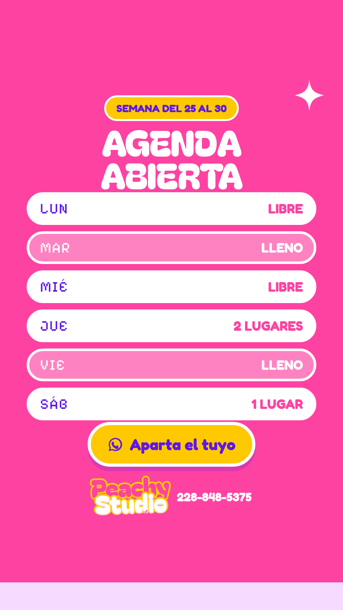

**Objetivo:** llenar la semana usando escasez **real**, no inventada.

- **Qué hace por el negocio:** es la plantilla más rentable del set. Ver “VIE — LLENO” hace que el sábado se aparte solo.
- **Qué se ve:** rango de fechas, seis renglones de lunes a sábado con su estado, y botón de WhatsApp.
- **Campos editables:** rango de fechas · estado de cada día (LIBRE / LLENO / n LUGARES).
- **CTA:** “Aparta el tuyo”.
- **Cómo medir:** citas agendadas dentro de las 24 h siguientes.
- **Regla:** nunca marcar LLENO un día que no lo está. La escasez falsa se nota y quema la credibilidad.

### 11 · Último lugar de hoy
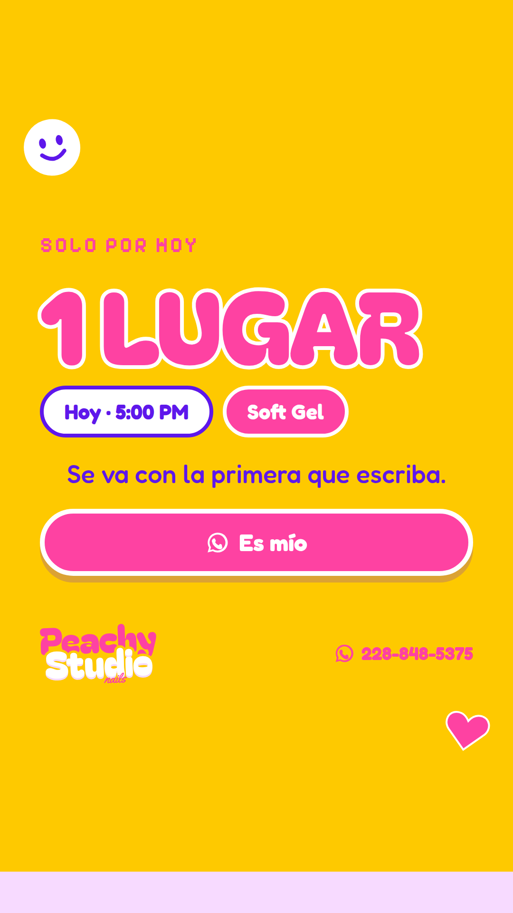

**Objetivo:** rescatar el dinero que se pierde cuando alguien cancela.

- **Qué hace por el negocio:** convierte una cancelación en venta el mismo día. Amarillo, hora concreta y una sola idea: velocidad.
- **Qué se ve:** número de lugares enorme, hora, servicio y frase de urgencia.
- **Campos editables:** número de lugares · hora · servicio · frase.
- **CTA:** “Es mío”.
- **Cómo medir:** minutos hasta el primer mensaje y huecos recuperados al mes.
- **Regla:** máximo una al día. Si se publica todos los días, deja de ser urgencia y parece agenda vacía.

### 12 · Promo del mes
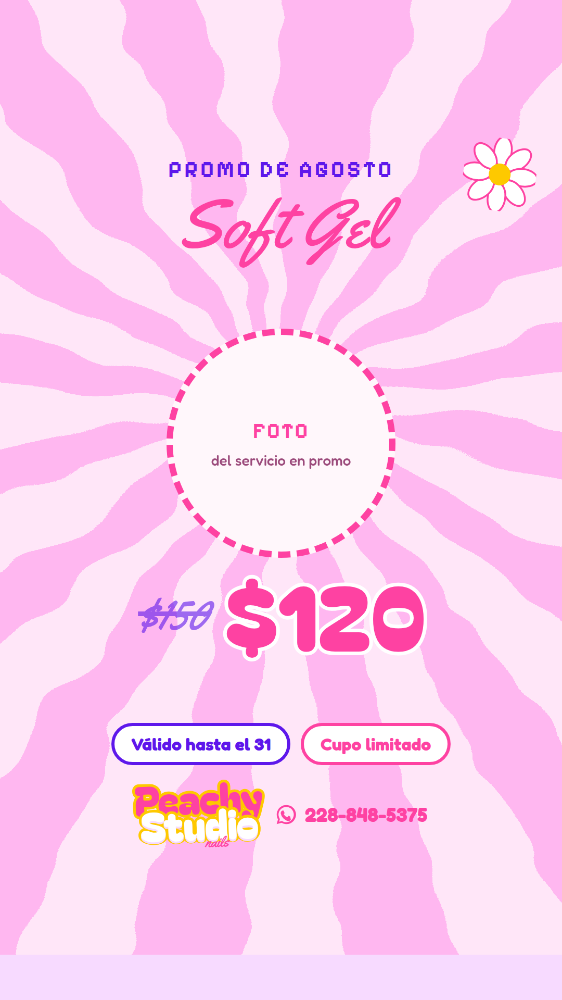

**Objetivo:** activar demanda en las semanas flojas sin desprestigiar el precio normal.

- **Qué hace por el negocio:** ordena las promociones. Al haber una plantilla fija, la promoción se ve intencional y no improvisada.
- **Qué se ve:** mes, servicio en script, foto redonda, precio anterior tachado y precio nuevo grande, vigencia.
- **Campos editables:** mes · servicio · foto · precio antes y ahora · vigencia.
- **CTA:** vigencia + cupo limitado.
- **Cómo medir:** citas del servicio en promoción contra el mes anterior.
- **Regla:** siempre con fecha de término visible. Una promoción sin vigencia se convierte en el precio nuevo.

### 13 · Cómo agendar
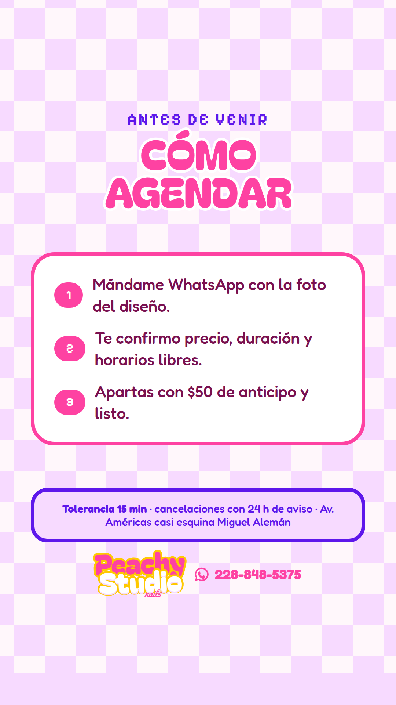

**Objetivo:** que agendar sea obvio y que las reglas del studio se entiendan
antes de la cita, no durante.

- **Qué hace por el negocio:** protege la agenda. El anticipo y la tolerancia dichos por adelantado reducen ausencias y discusiones.
- **Qué se ve:** tres pasos numerados y una franja con las políticas y la dirección.
- **Campos editables:** pasos · monto del anticipo · políticas · dirección.
- **CTA:** implícito en el paso 1.
- **Cómo medir:** ausencias sin aviso al mes.
- **Uso:** fijarla como **destacado permanente** del perfil.

### 14 · Recordatorio de retoque
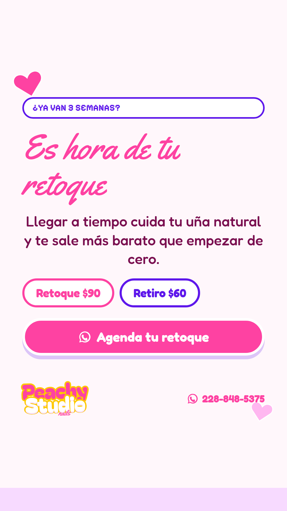

**Objetivo:** recompra. Una clienta que regresa cada tres semanas vale más que
tres clientas nuevas que van una vez.

- **Qué hace por el negocio:** es la plantilla de mayor retorno a largo plazo y la que más se olvida publicar. Convierte una base de clientas en ingreso recurrente.
- **Qué se ve:** pregunta-gancho sobre el tiempo transcurrido, titular en script, argumento de cuidado y precios de retoque y retiro.
- **Campos editables:** tiempo transcurrido · titular · precios · CTA.
- **CTA:** “Agenda tu retoque”.
- **Cómo medir:** porcentaje de clientas que regresan antes de las cuatro semanas.

### 15 · Nueva técnica
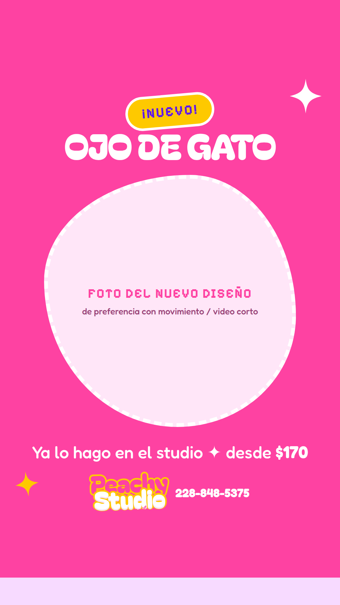

**Objetivo:** anunciar novedad y empujar el ticket promedio hacia arriba.

- **Qué hace por el negocio:** da razón para volver a quien ya es clienta y posiciona a Peachy como la que trae primero lo nuevo a Xalapa.
- **Qué se ve:** sello ¡NUEVO!, nombre de la técnica, foto o video del acabado y precio desde.
- **Campos editables:** nombre de la técnica · foto · precio desde.
- **CTA:** “Ya lo hago en el studio”.
- **Cómo medir:** solicitudes de la técnica nueva en las dos semanas siguientes.

---

## 4. Cuáles cuatro construir primero

Las quince ideas caben en cuatro chasis. Estos son los cuatro que recomiendo,
y qué usos absorbe cada uno:

| Plantilla a construir | Chasis | Absorbe los usos | Por qué esta |
|-----------------------|--------|------------------|--------------|
| **1. Diseño del día** | A · FOTO | 1, 2, 3, 15 | Es el uso diario. Sin ella no hay presencia constante. |
| **2. Agenda de la semana** | B · AGENDA | 10, 11 | Es la que llena huecos, la que se traduce en dinero esta semana. |
| **3. Cotiza tu diseño** | C · INTERACCIÓN | 4, 5, 8 | Abre conversaciones de WhatsApp y sostiene el alcance. |
| **4. Aviso / mensaje** | D · AVISO | 6, 7, 9, 12, 13, 14 | El comodín: tip, mito, precios, promo, políticas y retoque. |

Con esas cuatro se cubre una semana completa sin repetir y sin diseñar nada nuevo:

| Día | Plantilla | Uso |
|-----|-----------|-----|
| Lunes | Agenda | Agenda de la semana |
| Martes | Diseño del día | Portafolio |
| Miércoles | Aviso | Tip de cuidado |
| Jueves | Diseño del día | Antes y después |
| Viernes | Agenda | Último lugar de hoy |
| Sábado | Interacción | Esto o esto / caja de preguntas |
| Domingo | Aviso | Recordatorio de retoque |

## 5. Banca de suplentes

Tres ideas que no entraron a las quince pero que valen para temporada:

- **Tarjeta de regalo** — Navidad, 10 de mayo, cumpleaños. Ticket alto, ya existe el diseño en Canva.
- **Cuenta regresiva a fecha fuerte** — graduaciones, 14 de febrero, bodas. Anticipa la saturación de agenda.
- **Bienvenida a nuevas seguidoras** — quién es Peachy, dónde está, qué hace. Para el destacado del perfil.

## 6. Cómo se mantienen en el tiempo

1. **Nunca se edita la plantilla original.** En Canva se usa *Usar plantilla* / *Hacer una copia*; el archivo maestro se queda intacto.
2. **Solo se tocan los campos marcados.** Si hace falta mover una caja, es señal de que el uso no corresponde a ese chasis.
3. **Textos con largo máximo.** Un titular de dos líneas no puede volverse de cuatro: rompe la zona segura.
4. **Fotos siempre verticales**, luz natural, fondo liso. La plantilla no arregla una foto mal tomada.
5. **Revisión trimestral** de precios, servicios, horarios y dirección — sobre todo del menú de precios.
6. **Una carpeta por marca en Canva** (ver `brand-kit-canva.md`), con las plantillas maestras separadas de las piezas publicadas.

---

## Pendientes detectados

- `identidad.md` lista precios incompletos y desfasados frente al menú vigente en Canva.
  El menú vigente (usado en estas maquetas) es: Manicura Rusa $50 · Manicura Spa $70 ·
  Polish $80 · Kapping/Rubber $100 · Soft Gel $150 · Poly Gel $170 · Retoque $90 · Retiro $60.
  **Confirmar cuál es el bueno antes de publicar la plantilla 09.**
- Falta el logotipo en PNG con fondo transparente en `referencias/`.
  El dominio de descarga de Canva está bloqueado por la política de red de esta sesión,
  así que hay que exportarlo manualmente desde el Canva `ARCHIVOS PEACHE` (página 1).
- Las carpetas de Drive `peachystudio/Fotos`, `Videos` y `Fuentes` están vacías.
