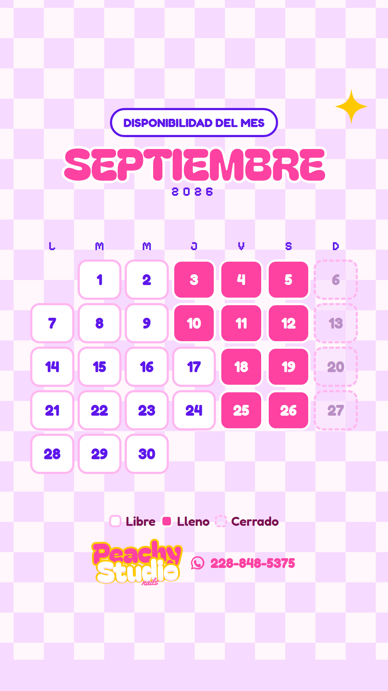
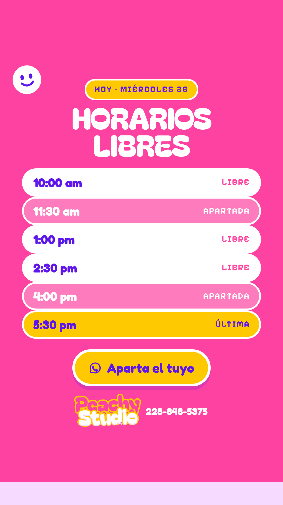
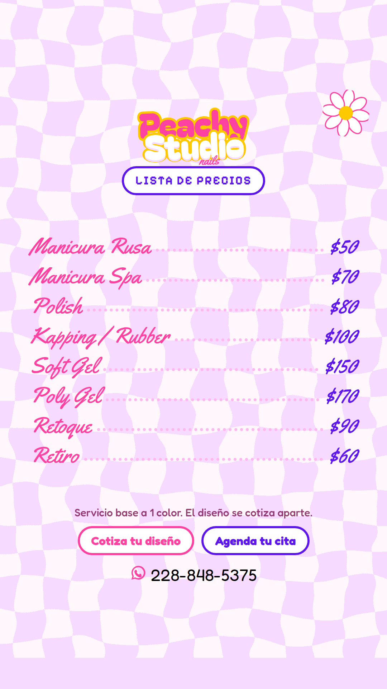
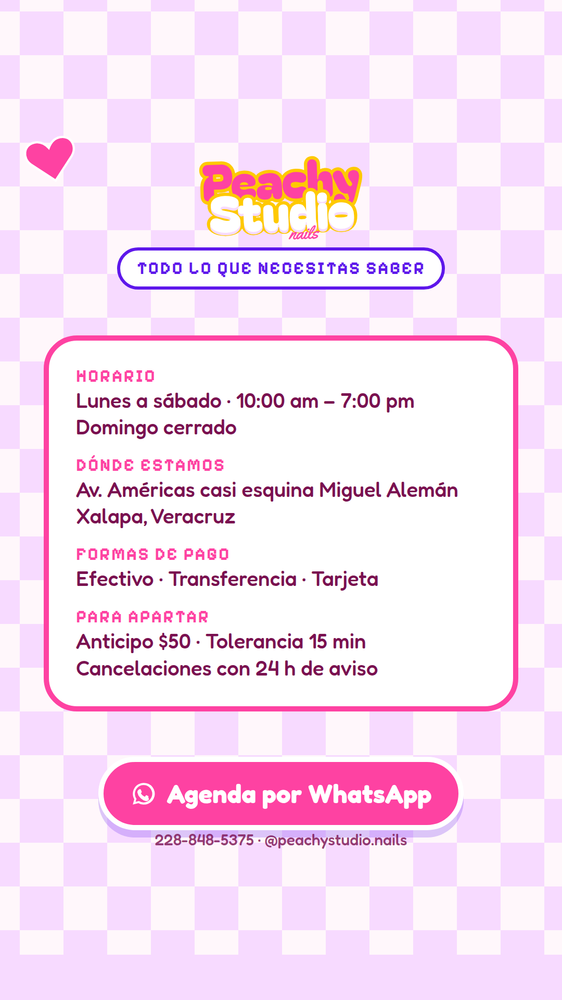
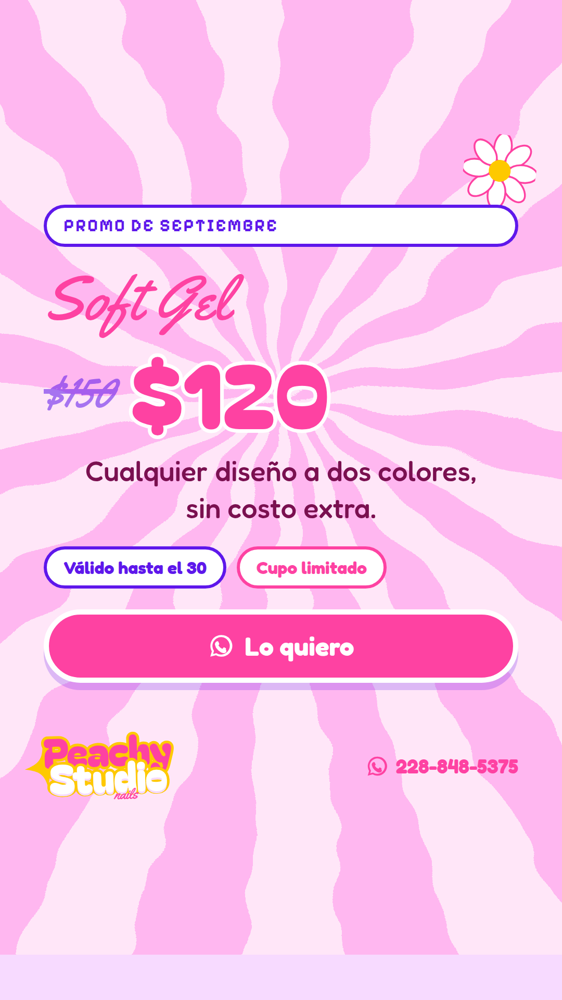

# Peachy Studio — Selección de 6 plantillas base

Después de sumar las plantillas **de servicio** (citas, precios, calendario e
información del studio) al catálogo inicial, el catálogo pasó de 15 a **22 usos**.
Estas seis plantillas los cubren todos.

Maquetas: [`plantillas/seleccion/png/`](plantillas/seleccion/png/) · fuentes: [`plantillas/seleccion/`](plantillas/seleccion/)

---

## Lo que se agregó al catálogo

Las 15 primeras eran de contenido (portafolio, educación, promoción). Faltaba lo
que una clienta busca cuando ya quiere ir: **cuándo, cuánto, dónde y cómo**.

| # | Uso nuevo | Qué resuelve |
|---|-----------|--------------|
| 16 | Calendario del mes | Disponibilidad de todo el mes de un vistazo |
| 17 | Citas disponibles del día | Horarios concretos libres y apartados |
| 18 | Horarios de atención | Qué días y a qué hora abre el studio |
| 19 | Ubicación y cómo llegar | Dirección, referencia y zona |
| 20 | Formas de pago y anticipo | Efectivo, transferencia, tarjeta, monto de anticipo |
| 21 | Aviso importante | Cierre, vacaciones, cambio de horario, día festivo |
| 22 | Recordatorio de cita | Confirmar a quien ya está agendada |

---

## Las 6 plantillas

### S1 · Calendario del mes

**Objetivo:** que la clienta vea el mes completo y entienda sola que si no aparta
ahora, se queda sin lugar.

- **Información que lleva:** mes y año, cuadrícula de días, estado de cada día y leyenda.
- **Estados:** *Libre* (blanco), *Lleno* (rosa), *Cerrado* (punteado).
- **Campos editables:** mes · año · número de días · estado de cada día.
- **Ritmo:** una vez al inicio del mes, y se repone a media quincena con los estados actualizados.
- **Cubre el uso:** 16.
- **Regla:** los estados tienen que ser verdaderos. Un calendario inflado se nota en dos semanas.

### S2 · Citas disponibles

**Objetivo:** convertir el mismo día. Bajar del mes a la hora concreta, que es donde
se decide una cita.

- **Información que lleva:** fecha, lista de horarios con su estado y botón de WhatsApp.
- **Estados:** *Libre*, *Apartada*, *Última* (resaltada en amarillo).
- **Campos editables:** fecha · horarios · estado de cada uno.
- **Ritmo:** cada mañana, o cuando se libere un hueco por cancelación.
- **Cubre los usos:** 10 (agenda de la semana), 11 (último lugar), 17, 22 (recordatorio de cita).
- **Variantes:** cambiando la etiqueta de arriba sirve para *hoy*, *esta semana* o *último lugar*.

### S3 · Lista de precios

**Objetivo:** contestar de una vez la pregunta que más tiempo consume, y filtrar.
Quien escribe después de ver precios ya viene calificada.

- **Información que lleva:** logotipo, servicios con precio, nota al pie y contacto.
- **Campos editables:** servicios · precios · nota al pie.
- **Ritmo:** una o dos veces al mes, y cada vez que cambie un precio.
- **Cubre el uso:** 09.
- **Mantenimiento:** es la única con caducidad real. Revisar cada tres meses.

### S4 · Información del studio

**Objetivo:** resolver en una sola historia todo lo logístico, para dejar de
contestarlo por mensaje una y otra vez.

- **Información que lleva:** horario, dirección, formas de pago y condiciones para apartar.
- **Campos editables:** los cuatro bloques (etiqueta y contenido de cada uno).
- **Ritmo:** una vez cada quince días, y fija como **destacado permanente** del perfil.
- **Cubre los usos:** 13 (cómo agendar), 18, 19, 20.
- **Variantes:** los bloques son intercambiables — se puede armar una versión solo de pagos, o solo de ubicación.

### S5 · Diseño del día

**Objetivo:** que el trabajo terminado sea la publicidad. Es el motor de contenido
del studio, la que sostiene la presencia diaria.

- **Información que lleva:** etiqueta, nombre del diseño, foto, técnica y precio.
- **Campos editables:** etiqueta · nombre del diseño · foto · técnica · precio.
- **Ritmo:** tres a cinco veces por semana.
- **Cubre los usos:** 01, 02 (antes y después), 03 (proceso), 04 (esto o esto), 15 (nueva técnica).
- **Tres modos del hueco visual:**
  - **una foto grande** — portafolio y técnica nueva;
  - **dos fotos** — antes y después, o esto o esto;
  - **video vertical** — detrás de cámaras.
- **Dos modos del bloque inferior:** *datos* (técnica y precio) o *sticker* (encuesta o caja de preguntas).

### S6 · Aviso o promoción

**Objetivo:** el comodín. Un mensaje, una idea, un formato fijo — sirve para
cualquier cosa que se tenga que decir con palabras.

- **Información que lleva:** etiqueta, titular, apoyo, dos datos en píldora y CTA.
- **Campos editables:** etiqueta · titular · texto de apoyo · dos píldoras · CTA.
- **Ritmo:** una o dos veces por semana.
- **Cubre los usos:** 05 (cotiza tu diseño), 06 (tip de cuidado), 07 (mito y verdad),
  08 (testimonio), 12 (promo del mes), 14 (recordatorio de retoque), 21 (aviso importante).
- **Dos modos del bloque inferior:** *CTA* (botón de WhatsApp) o *sticker* (caja de preguntas).

---

## Cobertura completa

| Plantilla | Usos que absorbe |
|-----------|------------------|
| S1 · Calendario del mes | 16 |
| S2 · Citas disponibles | 10 · 11 · 17 · 22 |
| S3 · Lista de precios | 09 |
| S4 · Información del studio | 13 · 18 · 19 · 20 |
| S5 · Diseño del día | 01 · 02 · 03 · 04 · 15 |
| S6 · Aviso o promoción | 05 · 06 · 07 · 08 · 12 · 14 · 21 |

Los 22 usos quedan cubiertos con seis archivos maestros.

## Una semana con solo estas seis

| Día | Plantilla | Qué se publica |
|-----|-----------|----------------|
| Lunes | S2 · Citas | Horarios libres de la semana |
| Martes | S5 · Diseño del día | Portafolio |
| Miércoles | S6 · Aviso | Tip de cuidado |
| Jueves | S5 · Diseño del día | Antes y después |
| Viernes | S2 · Citas | Último lugar de hoy |
| Sábado | S5 · Diseño del día | Esto o esto, con encuesta |
| Domingo | S6 · Aviso | Recordatorio de retoque |
| Día 1 del mes | S1 · Calendario | Disponibilidad del mes |
| Quincenal | S3 · Precios · S4 · Info | Precios y logística |

## Reglas de mantenimiento

1. **Nunca se edita la maestra.** En Canva siempre *Usar plantilla*.
2. **Los estados se dicen como son.** Libre, lleno y cerrado tienen que corresponder a la agenda real.
3. **Los textos no crecen.** Si no cabe el titular, se acorta el copy; no se achica la fuente.
4. **Todo lo importante entre 300 px y 1630 px**, o Instagram lo tapa.
5. **Revisión trimestral** de precios, horarios, dirección y formas de pago.
